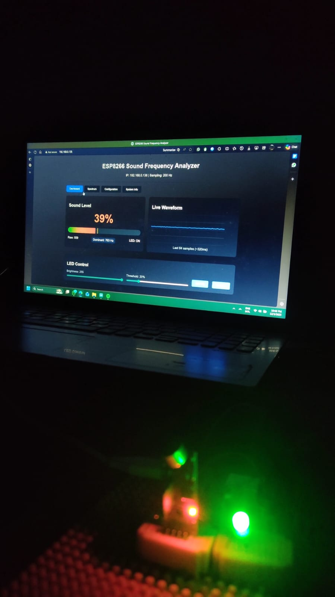
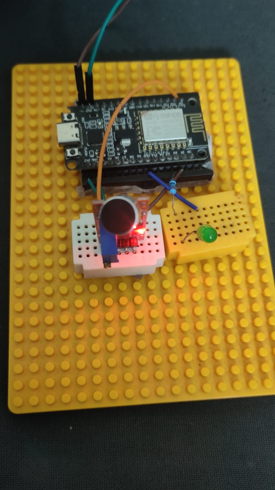

# 🧠🔊 ESP8266 SmartSound – IoT Audio Frequency Analyzer & Visualizer

An advanced **IoT-powered real-time sound monitoring system** built using the **ESP8266 NodeMCU**, capable of analyzing sound intensity, waveform patterns, and dominant frequencies—displayed live on a responsive web dashboard.

This system captures audio signals using the **KY-037 high-sensitivity microphone**, performs onboard signal processing, and presents the results over WiFi through a fully interactive web interface.

---

## 📸 Project Demo

### **Web Dashboard (Real-Time Visualization)**
  
*Live waveform, sound level, dominant frequency, and LED control panel.*

### **Physical Hardware Setup**
  
*Actual prototype showing NodeMCU, KY-037 mic module, and LED output.*

---

## 🚀 Key Features

- 🔄 **Real-Time Waveform Visualization** via WebSockets for ultra-responsive plotting  
- 📡 **Frequency Detection Engine** to compute and display dominant audio frequencies (Hz)  
- 💡 **Remote LED Control**—brightness and threshold-based activation  
- 📊 **Sound Level Indicator** with automatic scaling  
- 📱 **Full Web Dashboard** (HTML/CSS/JS) served directly from ESP8266  
- 🔔 **Dual-Mode Microphone Support**  
  - Analog (A0) → waveform + amplitude  
  - Digital (D0) → threshold interrupts  
- ⚡ Lightweight, fast, and optimized for continuous monitoring  

---

## 🛠️ Hardware Components

| Component | Description |
|----------|-------------|
| ESP8266 NodeMCU (Lolin V3) | WiFi-enabled microcontroller & web server |
| KY-037 Microphone Module | High-sensitivity sound sensor |
| LED (Green) | Visual output indicator |
| 220Ω Resistor | Current limiting for LED |
| Breadboard & Jumper Wires | For prototyping |

---

## 🔌 Circuit Diagram

The KY-037 microphone feeds both **analog audio** and **digital threshold** outputs into the NodeMCU. The LED is driven by a GPIO pin for brightness control.

### **Circuit Images**
  


### **Pinout Configuration**

| Component | Pin | ESP8266 Pin |
|----------|-----|--------------|
| KY-037 | A0 | A0 (ADC0) |
| KY-037 | D0 | D1 (GPIO 5) |
| KY-037 | VCC | 3V3 |
| KY-037 | GND | GND |
| LED | Anode (+) | D2 (GPIO 4) |

---

## 💻 Software & Libraries

### Development Environment
- Arduino IDE

### Required Libraries
- `ESP8266WiFi.h` – WiFi connectivity  
- `ESPAsyncWebServer.h` – async web server  
- `WebSocketsServer.h` – real-time WebSocket communication  
- `arduinoFFT.h` – optional for FFT-based frequency detection  

---

## 📂 Included Source Files

### **1. SoundAnalyzer.ino**
Handles:
- Audio sampling  
- Level calculation  
- Waveform streaming  
- LED control logic  
- Web server + WebSocket dashboard  

### **2. SmartSound.ino**
Enhanced version with:
- Smarter noise filtering  
- Improved threshold logic  
- Frequency smoothing  
- Modularized DSP code  
- (Optional) hooks for AI-based sound classification  

> Store `SmartSound.ino` in the same project folder or `/src/`.

---

## 🔧 Installation & Setup

1. Clone this repository  
2. Open `SoundAnalyzer.ino` or `SmartSound.ino` in Arduino IDE  
3. Install required libraries from Library Manager  
4. Enter your WiFi credentials:

```cpp
const char* ssid = "YOUR_SSID";
const char* password = "YOUR_PASSWORD";
