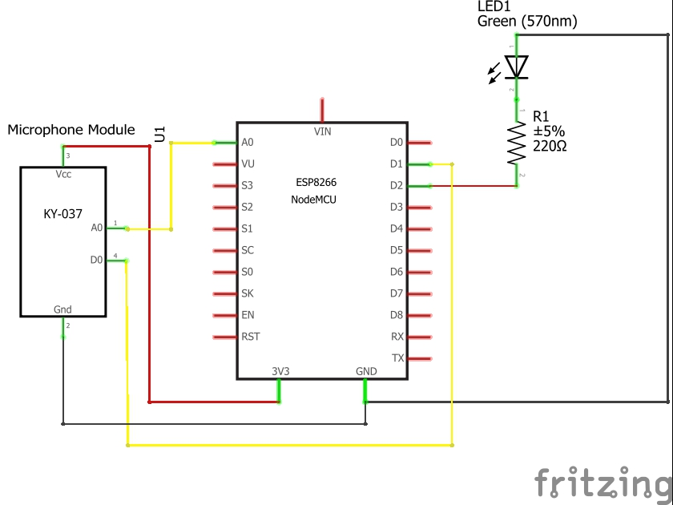
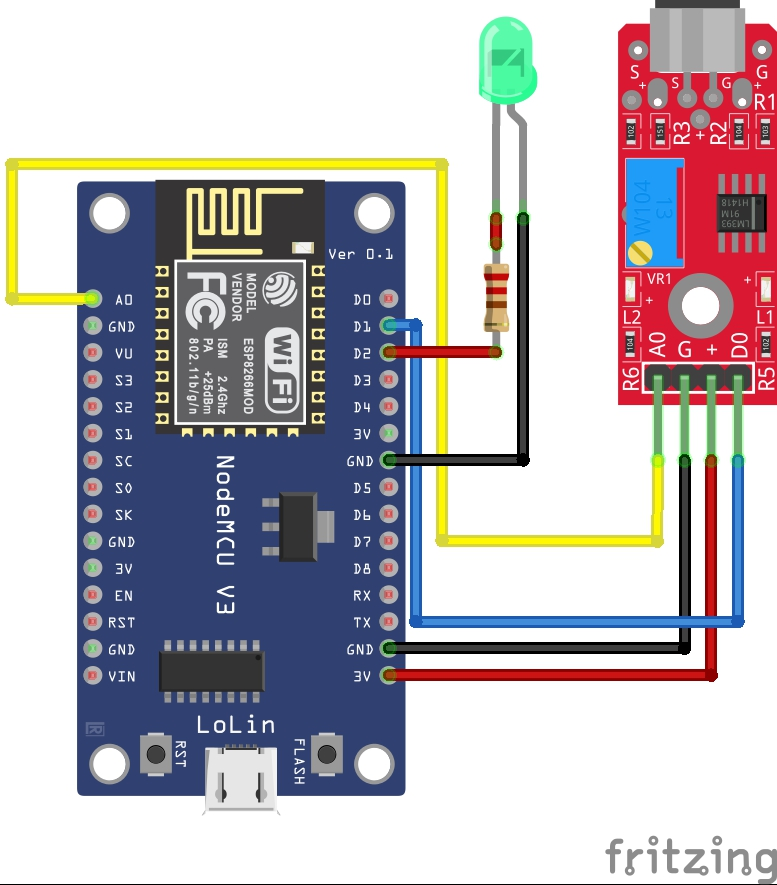

# ESP8266 IoT Sound Frequency Analyzer & Visualizer

An IoT-based sound monitoring system that visualizes audio data in real-time using an ESP8266 NodeMCU and a Web Interface. This project captures audio via a KY-037 microphone, performs signal processing, and displays the waveform, sound level, and dominant frequency on a responsive web dashboard.

## 📸 Project Demo

*Real-time dashboard showing Sound Level (39%), Live Waveform, and LED controls.*

## 🚀 Features
* **Real-Time Visualization:** Live waveform plotting using WebSockets.
* **Frequency Analysis:** Calculates and displays the dominant frequency (Hz).
* **Remote Control:** Control LED brightness and sound threshold sensitivity via the web UI.
* **Responsive Dashboard:** Custom HTML/CSS/JS interface hosted directly on the ESP8266.
* **Dual Mode Sensing:** Utilizes both Analog (A0) for waveform and Digital (D0) for threshold triggers.

## 🛠️ Hardware Components
* **Microcontroller:** ESP8266 NodeMCU (Lolin V3)
* **Sensor:** KY-037 Microphone Module (High Sensitivity)
* **Actuator:** LED (Green) + 220Ω Resistor
* **Breadboard & Jumper Wires**

## 🔌 Circuit Diagram
The system connects the Microphone analog output to the ESP8266 ADC for sampling, and the digital output for hardware interrupts.

### Pinout Configuration:
| Component | Pin | ESP8266 NodeMCU Pin |
| :--- | :--- | :--- |
| **KY-037** | A0 | A0 (ADC0) |
| **KY-037** | D0 | D1 (GPIO 5) |
| **KY-037** | VCC | 3V3 (VU) |
| **KY-037** | GND | GND |
| **LED** | Anode (+) | D2 (GPIO 4) |

## 💻 Software & Libraries
* **Framework:** Arduino IDE
* **Key Libraries:**
    * `ESP8266WiFi.h` (Connectivity)
    * `ESPAsyncWebServer.h` (Web Interface)
    * `arduinoFFT.h` (Optional: If used for frequency calculation)

## 🔧 Installation & Setup
1.  Clone this repository.
2.  Open `SoundAnalyzer.ino` in Arduino IDE.
3.  Install the required libraries via Library Manager.
4.  Update the `ssid` and `password` variables with your WiFi credentials.
5.  Upload the code to the NodeMCU.
6.  Open the Serial Monitor (115200 baud) to find the IP address.
7.  Type the IP address in your browser to access the dashboard.

## 🤝 Contributing
Feel free to submit pull requests or open issues to improve the signal processing algorithms or UI!
